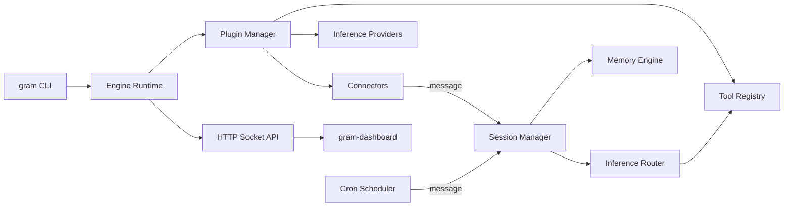

# grambot

A minimal, composable AI agent framework with plugin-driven architecture.

## Features

- **Plugin system** - Connectors, inference providers, tools, and image generators as plugins
- **Session management** - Per-channel message sequencing with persistent state
- **Memory engine** - Searchable conversation history across sessions
- **Cron scheduler** - Timed message dispatch and scheduled actions
- **Multi-provider inference** - Anthropic Claude, OpenAI, and more
- **Runtime management** - PM2 process control and Docker container execution
- **Dashboard** - React SPA for monitoring and control

## Architecture



## Quick Start

```sh
# Install dependencies
yarn install

# Build the project
yarn build

# Start the engine
yarn gram start
```

## Configuration

Grambot uses two configuration files in `.scout/`:

**settings.json** - Engine and plugin configuration
```json
{
  "engine": { "socketPath": ".scout/scout.sock", "dataDir": ".scout" },
  "plugins": [
    { "id": "telegram", "enabled": true },
    { "id": "anthropic", "enabled": true }
  ],
  "inference": {
    "providers": [{ "id": "anthropic", "model": "claude-sonnet-4-20250514" }]
  }
}
```

**secrets.json** - API keys and tokens
```json
{
  "version": 1,
  "secrets": {
    "telegram": { "token": "..." },
    "anthropic": { "apiKey": "..." }
  }
}
```

## Plugins

| Plugin | Type | Description |
|--------|------|-------------|
| telegram | Connector | Telegram bot with long polling |
| anthropic | Inference | Claude models via Anthropic API |
| openai-codex | Inference | GPT models via OpenAI API |
| brave-search | Tool | Web search integration |
| gpt-image | Image | OpenAI image generation |
| nanobanana | Image | Alternative image provider |

## Tools

The AI agent has access to these tools:

- `add_cron` - Schedule recurring tasks
- `memory_search` - Query conversation history
- `web_search` - Search the web (Brave)
- `generate_image` - Create images
- `set_reaction` - React to messages
- `pm2_manage` - Manage processes (list, start, stop, restart)
- `docker_run` - Execute commands in containers

## CLI Commands

```sh
gram start                    # Launch the engine
gram status                   # Check engine status
gram plugins load <id>        # Load a plugin
gram plugins unload <id>      # Unload a plugin
gram secrets set <plugin> <key> <value>  # Store a secret
```

## Development

```sh
yarn install      # Install dependencies
yarn build        # Compile TypeScript
yarn test         # Run tests
yarn typecheck    # Type check without emit
yarn dev          # Run with tsx (no build)
```

## Workspace

- `packages/gram` - Core engine, plugins, and tools
- `packages/gram-dashboard` - React dashboard + API proxy

## Documentation

See [docs/](./docs/) for detailed documentation:

- [Architecture](./docs/architecture.md) - System overview
- [Plugins](./docs/plugins.md) - Plugin system
- [Sessions](./docs/sessions.md) - Session management
- [Memory](./docs/memory.md) - Memory engine
- [Cron](./docs/cron.md) - Scheduled tasks
- [Config](./docs/config.md) - Configuration reference
- [CLI](./docs/cli.md) - Command reference

## License

MIT
