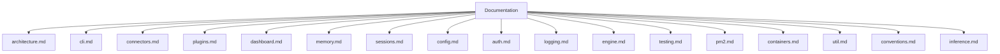

# Scout documentation

This folder documents the current Scout CLI, plugins, sessions, and runtime.

## Index
- `architecture.md` - system overview and message flow
- `cli.md` - CLI commands and runtime behavior
- `connectors.md` - connector abstraction and telegram connector
- `plugins.md` - plugin system and built-in plugins
- `dashboard.md` - scout-dashboard SPA + proxy
- `memory.md` - memory engine and search
- `cron.md` - cron scheduler tasks and actions
- `auth.md` - secrets store and helper commands
- `inference.md` - inference runtime helpers
- `containers.md` - container runtime management (Docker)
- `pm2.md` - pm2 runtime process management
- `util.md` - shared utility helpers
- `conventions.md` - import and compatibility rules
- `sessions.md` - session queueing and sequencing
- `config.md` - config files and resolution order
- `logging.md` - logging configuration and output
- `engine.md` - engine socket updates and control plane
- `testing.md` - current test coverage

