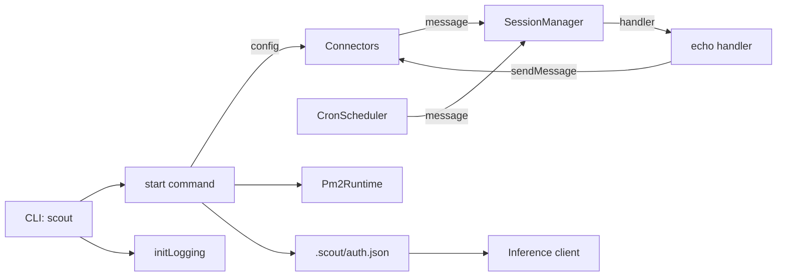

# Architecture

Scout is a CLI-driven agent runner that wires connectors to a session manager.

Key pieces:
- **CLI** (`sources/main.ts`) sets up commands and logging.
- **Connectors** expose `onMessage`/`sendMessage`.
- **Cron scheduler** emits messages on timers for internal automation.
- **PM2 runtime** keeps background processes running.
- **Auth** stores tokens for connectors and inference.
- **Inference** wraps model providers for Codex/Claude Code.
- **Session manager** serializes handling per session.
- **Logging** is centralized via `initLogging`.

## Message lifecycle (current)
1. Connector emits a `ConnectorMessage` and `MessageContext`.
2. `SessionManager` routes to a session (by source + channel or explicit sessionId).
3. Session processes messages sequentially.
4. Handler echoes the message back through the originating connector.
