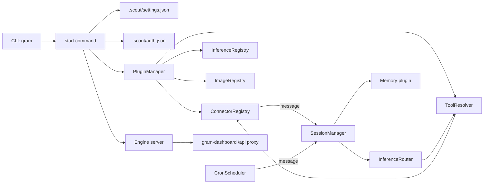

# Architecture

Grambot is a plugin-driven engine that routes connector traffic through sessions, inference, tools, and memory.

Key pieces:
- **CLI** (`sources/main.ts`) starts the engine and manages plugins/auth.
- **Plugins** register connectors, inference providers, tools, and image generators.
- **Auth store** (`.scout/auth.json`) holds provider credentials.
- **File store** persists attachments for connectors and tools.
- **Session manager** serializes handling per session and persists state.
- **Memory plugin** records session updates and supports queries.
- **Cron scheduler** emits timed messages into sessions.
- **Inference router** picks providers from settings.
- **Engine server** exposes a local HTTP socket + SSE for status/events.
- **Dashboard** (`gram-dashboard`) proxies `/api` to the engine socket.

## Message lifecycle
1. Connector emits a `ConnectorMessage` (text + files).
2. `SessionManager` routes to a session (source + channel or explicit sessionId).
3. `Engine` builds a LLM context with attachments.
4. Inference runs with tools (cron, memory, web search, image generation).
5. Responses and generated files are sent back through the connector.
6. Session state + memory are updated.
