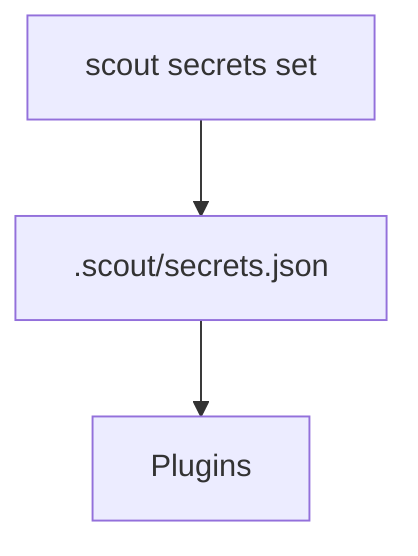

# Secrets Store

Scout stores plugin credentials in `.scout/secrets.json`.
The file is read by the engine on startup and on demand by plugins.

## Structure
```json
{
  "version": 1,
  "secrets": {
    "telegram": { "token": "..." },
    "brave-search": { "apiKey": "..." },
    "openai-codex": { "apiKey": "..." },
    "anthropic": { "apiKey": "..." },
    "gpt-image": { "apiKey": "..." },
    "nanobanana": { "apiKey": "..." }
  }
}
```

## CLI helpers
- `scout secrets set <plugin> <key> <value>` updates the secrets store.



## Usage
- Connectors read secrets for auth (e.g., Telegram token).
- Inference providers read secrets for API keys.
- Tool plugins read secrets for external services.
