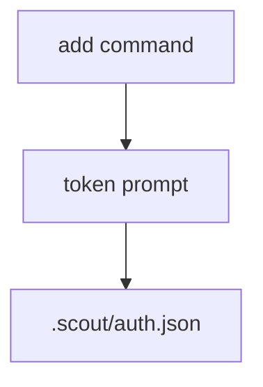

# Auth tokens

Scout stores connector and inference tokens in `.scout/auth.json`.

## Structure
```json
{
  "telegram": { "token": "..." },
  "codex": { "token": "..." },
  "claude-code": { "token": "..." }
}
```

## CLI helpers
- `scout add telegram` writes `auth.telegram.token`
- `scout add codex` writes `auth.codex.token`
- `scout add claude` writes `auth.claude-code.token`



## Usage
- `start` reads `.scout/auth.json` to load telegram tokens.
- `inference` helpers read `.scout/auth.json` when a token is not passed explicitly.
