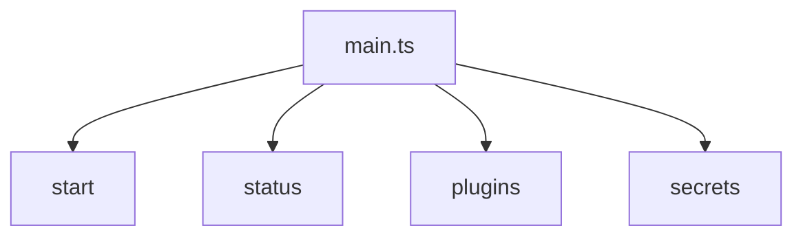
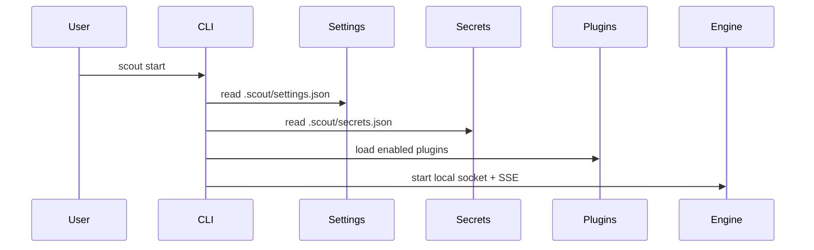

# CLI

The CLI is implemented with Commander in `sources/main.ts`. It always initializes logging first.

## Commands
- `start` - launches the engine (default settings `.scout/settings.json`).
- `status` - prints engine status if the socket is live.
- `plugins load <id>` - loads a plugin (updates settings if engine is down).
- `plugins unload <id>` - unloads a plugin.
- `secrets set <plugin> <key> <value>` - stores a plugin secret.

## Development
- `yarn dev` runs the CLI directly via `tsx`.

## start command flow

