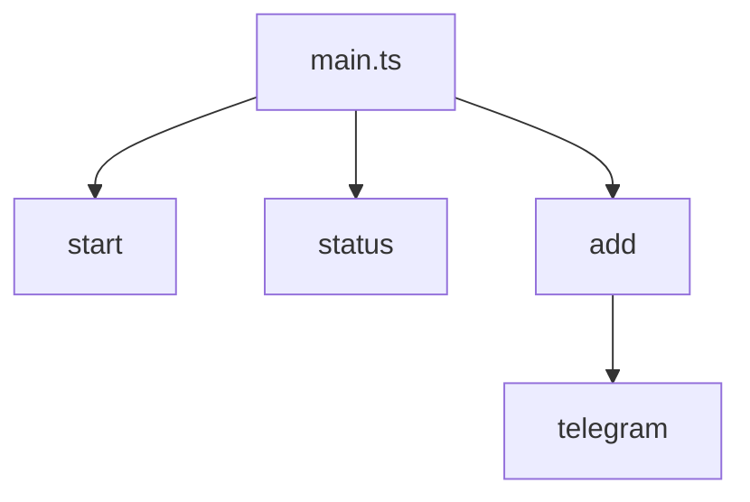
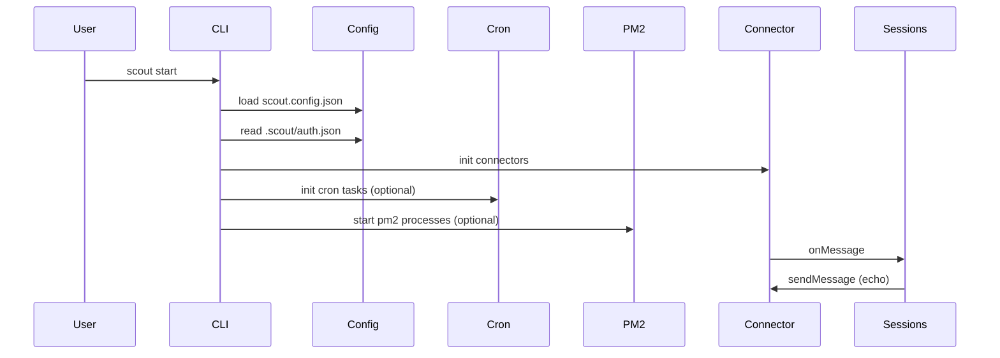

# CLI

The CLI is implemented with Commander in `sources/main.ts`. It always initializes logging first.

## Commands
- `start` - launches configured connectors and attaches the echo handler.
- `status` - placeholder status command.
- `add telegram` - prompts for a bot token and writes `.scout/auth.json`.
- `add codex` - prompts for a Codex token and writes `.scout/auth.json`.
- `add claude` - prompts for a Claude Code token and writes `.scout/auth.json`.

## Development
- `yarn dev` runs the CLI directly via `tsx`.

## start command flow

