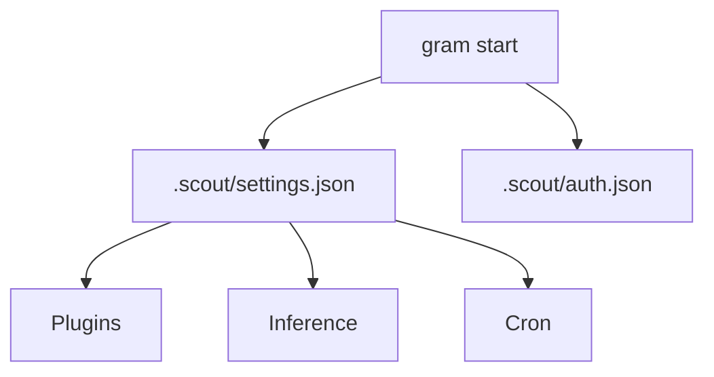

# Configuration

Grambot now reads from a single settings file plus the auth store.

- `.scout/settings.json` (or the path passed to `gram start --settings`)
- `.scout/auth.json` for credentials



## Sample `.scout/settings.json`
```json
{
  "engine": {
    "socketPath": ".scout/scout.sock",
    "dataDir": ".scout"
  },
  "plugins": [
    { "instanceId": "telegram", "pluginId": "telegram", "enabled": true, "settings": { "polling": true } },
    { "instanceId": "brave-search", "pluginId": "brave-search", "enabled": true },
    { "instanceId": "gpt-image", "pluginId": "gpt-image", "enabled": true },
    { "instanceId": "nanobanana", "pluginId": "nanobanana", "enabled": false, "settings": { "endpoint": "https://api.example.com/images" } },
    { "instanceId": "openai-codex", "pluginId": "openai-codex", "enabled": true },
    { "instanceId": "anthropic", "pluginId": "anthropic", "enabled": false },
    { "instanceId": "memory", "pluginId": "memory", "enabled": true }
  ],
  "inference": {
    "providers": [
      { "id": "openai-codex", "model": "gpt-4o-mini" }
    ]
  },
  "cron": {
    "tasks": [
      {
        "id": "heartbeat",
        "everyMs": 60000,
        "message": "ping",
        "action": "send-message",
        "runOnStart": true,
        "channelId": "local",
        "source": "telegram"
      }
    ]
  },
  "memory": {
    "enabled": true,
    "maxEntries": 1000
  }
}
```

`memory` settings are consumed by the memory plugin (if enabled).

## `.scout/auth.json`
Credentials are stored per plugin instance id:

```json
{
  "telegram": { "type": "token", "token": "..." },
  "brave-search": { "type": "apiKey", "apiKey": "..." },
  "openai-codex": { "type": "apiKey", "apiKey": "..." },
  "anthropic": { "type": "apiKey", "apiKey": "..." },
  "gpt-image": { "type": "apiKey", "apiKey": "..." },
  "nanobanana": { "type": "apiKey", "apiKey": "..." }
}
```
