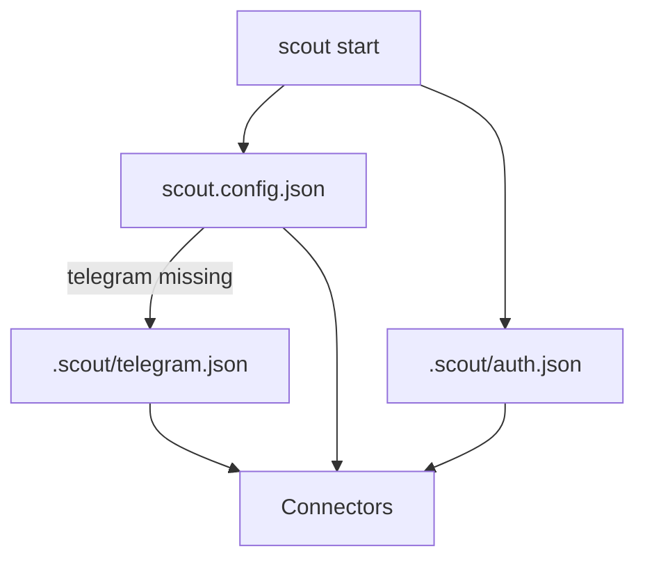

# Configuration

Scout reads config in two places when starting:
1. `scout.config.json` (or the path passed to `scout start --config`).
2. `.scout/telegram.json` as a fallback for Telegram settings.
3. `.scout/auth.json` for connector/inference tokens.



## Sample `scout.config.json`
```json
{
  "connectors": {
    "telegram": {
      "token": "...",
      "polling": true,
      "statePath": ".scout/telegram-offset.json",
      "retry": {
        "minDelayMs": 1000,
        "maxDelayMs": 30000,
        "factor": 2,
        "jitter": 0.2
      }
    },
    "chron": {
      "tasks": [
        {
          "id": "heartbeat",
          "everyMs": 60000,
          "message": "ping",
          "runOnStart": true,
          "channelId": "local"
        }
      ]
    }
  },
  "cron": {
    "tasks": [
      {
        "id": "heartbeat",
        "everyMs": 60000,
        "message": "ping",
        "runOnStart": true,
        "channelId": "local"
      }
    ]
  },
  "runtime": {
    "pm2": {
      "processes": [
        {
          "name": "worker",
          "script": "dist/worker.js",
          "args": ["--mode", "job"],
          "autorestart": true
        }
      ]
    }
  }
}
```

Notes:
- `cron` is the preferred top-level config for scheduled tasks.
- `connectors.chron` is still accepted for backward compatibility and will warn.
- `runtime.pm2` configures PM2-managed processes.
- `.scout/auth.json` is the preferred store for connector tokens.

## `.scout/telegram.json`
Written by `scout add telegram`.
```json
{ "token": "..." }
```
