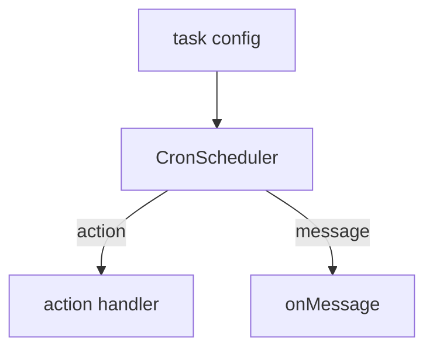

# Cron scheduler

The cron scheduler emits messages on a fixed cadence and can also invoke named actions.

## Concepts
- **Tasks** specify an interval (`everyMs`), optional `message`, and optional `action`.
- **Actions** are custom handlers invoked by name.
- **onMessage** is used when a task emits a message payload.
- **Runtime updates** can add tasks after start with `CronScheduler.addTask`.

## Task execution rules
- `runOnStart` triggers an immediate dispatch.
- `once` schedules a single execution.
- `message` is required unless `action` is set.

## Built-in action
- `send-message` sends `task.message` to the task's target channel.
- `task.source` selects the connector (defaults to `telegram`).
- `channelId` (or `sessionId`) should be set to target a real chat.
