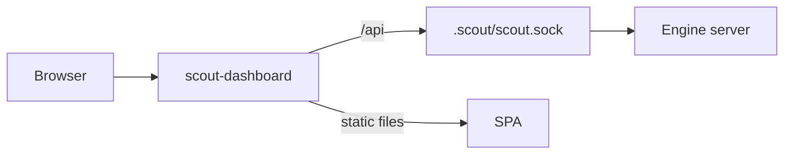

# Scout dashboard

`scout-dashboard` is a static SPA served by a lightweight Node proxy.
The proxy serves the UI and forwards `/api/*` to the local engine socket.

Default port: `7331`.

```mermaid
flowchart LR
  Browser[Browser] --> Dashboard[scout-dashboard]
  Dashboard -->|/api| Socket[.scout/scout.sock]
  Socket --> Engine[Engine server]
  Dashboard -->|static files| UI[SPA]
```
