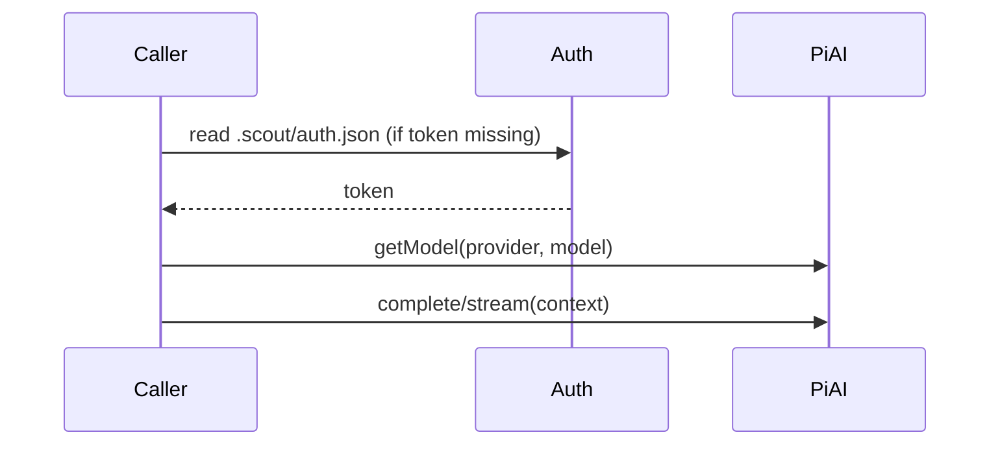

# Inference runtime

Scout ships an inference helper for Codex and Claude Code via `@mariozechner/pi-ai`.

## Exports
- `connectCodex({ model, token?, authPath? })`
- `connectClaudeCode({ model, token?, authPath? })`

Each returns an `InferenceClient` with:
- `complete(context, options?)`
- `stream(context, options?)`

