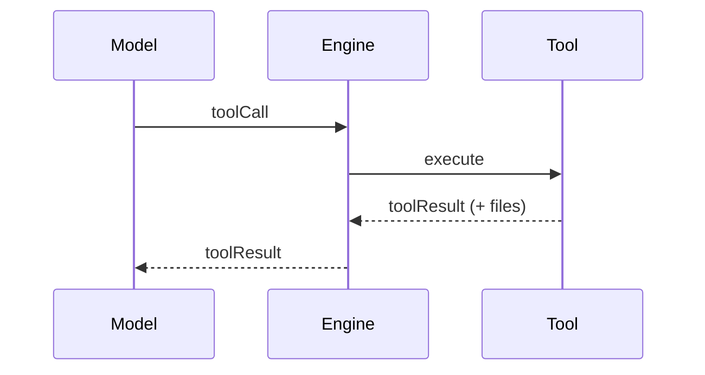
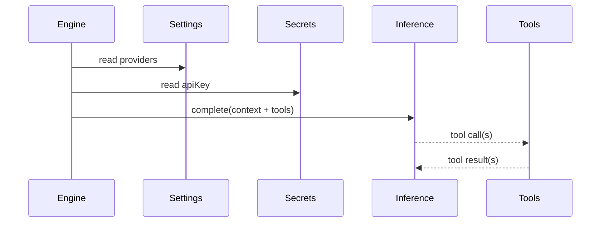

# Inference runtime

Inference is now a plugin capability. Providers register with the `InferenceRegistry`,
and the `InferenceRouter` selects them based on `.scout/settings.json`.

## Providers
Configured in settings:
```json
{
  "inference": {
    "providers": [
      { "id": "openai-codex", "model": "gpt-5.1-codex-mini" },
      { "id": "anthropic", "model": "claude-3-7-sonnet-latest" }
    ]
  }
}
```

## Tools
Tools are registered dynamically by plugins and core runtime:
- `add_cron` schedules a cron task.
- `memory_search` queries the memory engine.
- `web_search` (Brave) performs web search.
- `generate_image` uses registered image providers.




