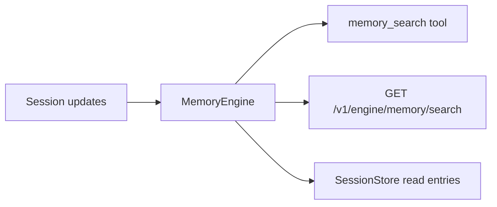

# Memory engine

The memory engine records session updates and supports keyword queries.

- Stored in `.scout/memory/memory.jsonl`.
- Each entry includes session id, role, text, and file references.
- Memory can read session logs via the session store API.

