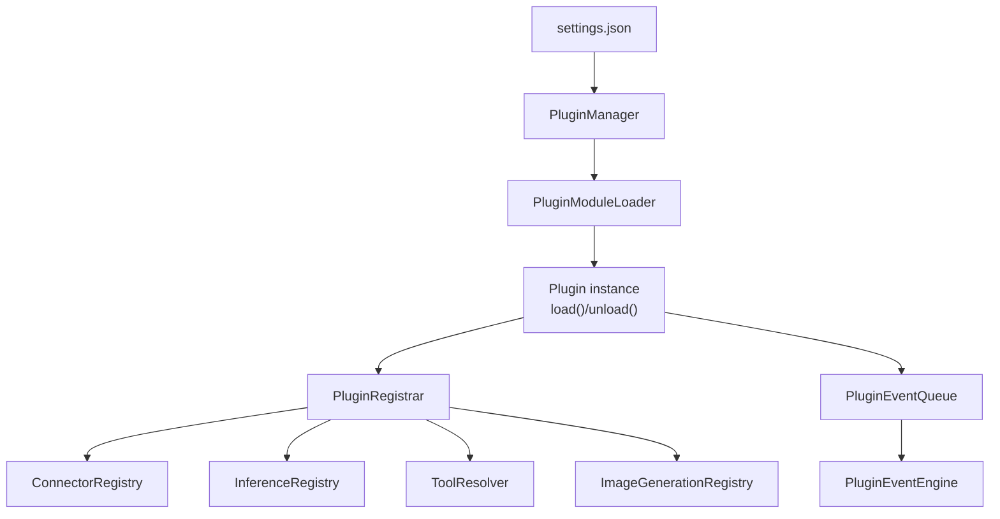

# Plugins

Plugins are first-class runtime modules that can register:
- Connectors
- Inference providers
- Tools
- Image generation providers

## Execution model
Plugins execute in the same Node.js process as the engine. There is no VM
isolation, so module caches and globals are shared across plugin instances.
Treat plugins as trusted code.

## Plugin protocol
Each plugin type is described by a JSON descriptor (`plugin.json` in the
plugin folder) and a module that exports a
`plugin` object (or default export) with:
- `settingsSchema` (Zod) to validate instance settings
- `create(api)` returning `{ load?, unload? }`

The plugin API surface is intentionally narrow:
- `api.instance`: `{ instanceId, pluginId, enabled }`
- `api.settings`: validated settings for the instance
- `api.engineSettings`: full engine settings snapshot
- `api.registrar`: connector/inference/tool/image registration
- `api.auth`: auth store (providers use the provider/plugin id; other plugins typically use instance id)
- `api.fileStore`: shared file store
- `api.logger`: per-plugin logger
- `api.mode`: `"runtime"` or `"validate"` (used during `gram add` validation)
- `api.engineEvents`: engine event bus (optional)
- `api.events.emit({ type, payload })`: enqueue plugin events

Load/unload is internal: the plugin manager reconciles enabled instances from
`.scout/settings.json` and loads or unloads instances to match.

### Descriptor format
```json
{
  "id": "telegram",
  "name": "Telegram",
  "description": "Telegram connector and incoming message adapter.",
  "entry": "./plugin.js"
}
```

### Settings format
```json
{
  "plugins": [
    {
      "instanceId": "telegram",
      "pluginId": "telegram",
      "enabled": true,
      "settings": { "polling": true }
    }
  ]
}
```

### Event format
Plugin events are queued and processed sequentially. Each event is persisted in
memory with metadata for later routing:
- `id` (generated)
- `pluginId`
- `instanceId`
- `type`
- `payload`
- `createdAt`

## Data & secrets
Each instance gets a dedicated data directory:
- `.scout/plugins/<instanceId>`

Credentials are stored in `.scout/auth.json` and keyed by the identifier the plugin uses.
Provider plugins store credentials under the provider id (same as `pluginId`), not the random instance id.



## Built-in plugins
- `telegram` (connector)
- `openai-codex` (inference)
- `anthropic` (inference)
- `brave-search` (tool)
- `gpt-image` (image)
- `nanobanana` (image)
- `memory` (tool + storage)
