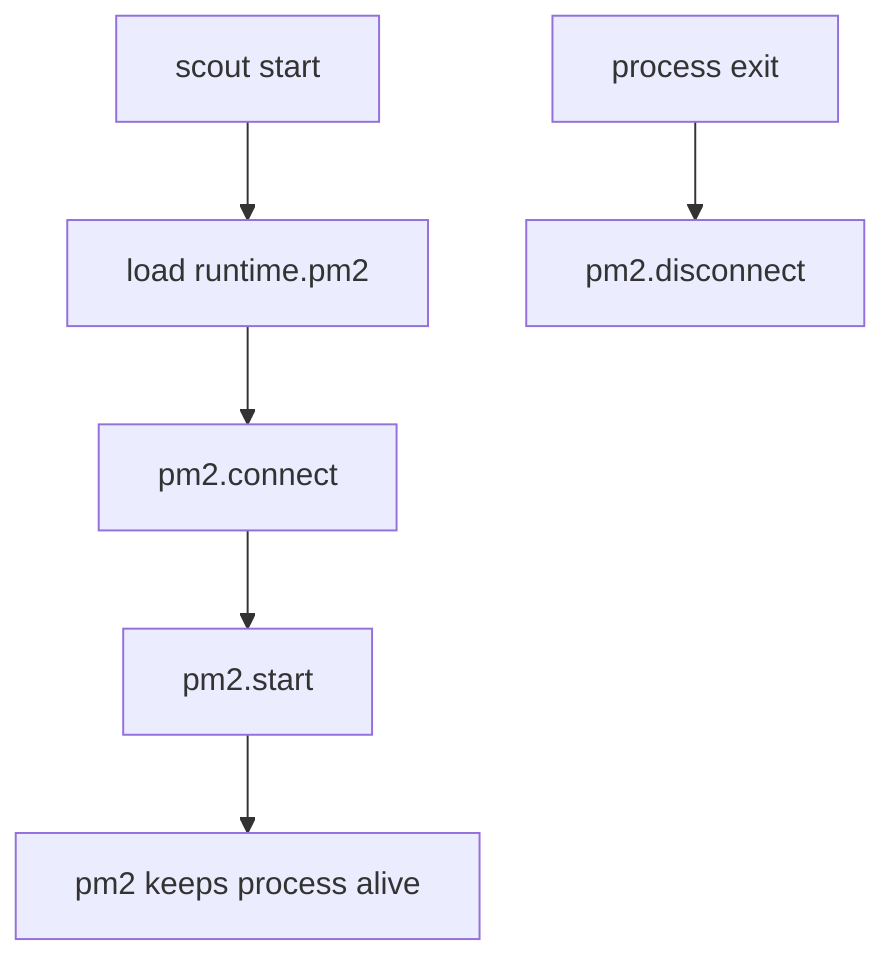
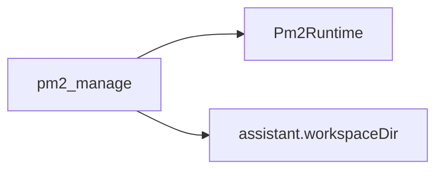

# PM2 runtime

Scout can launch long-running processes via programmatic PM2. This keeps processes alive independently of the CLI.
The assistant can also manage PM2 via the `pm2_manage` tool.

## Responsibilities
- Connect to PM2 daemon.
- Start configured processes with auto-restart enabled.
- Optionally disconnect on exit without stopping processes.
- Enforce workspace limits for assistant-triggered starts.



## Assistant tool
`pm2_manage` supports:
- `list`
- `start` (requires script within the configured workspace)
- `stop`
- `restart`
- `delete`



## Runtime config (excerpt)
```json
{
  "runtime": {
    "pm2": {
      "processes": [
        {
          "name": "worker",
          "script": "dist/worker.js",
          "args": ["--mode", "job"],
          "cwd": "/srv/scout",
          "env": { "NODE_ENV": "production" },
          "autorestart": true,
          "maxRestarts": 10,
          "minUptime": 5000
        }
      ]
    }
  }
}
```
