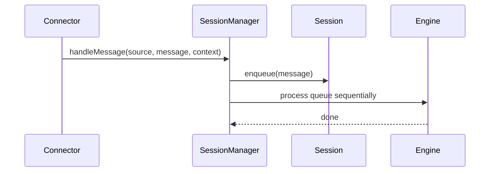
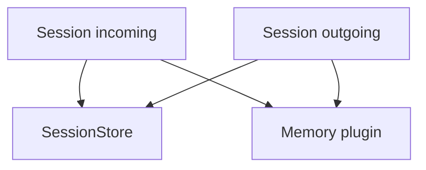

# Sessions

Sessions provide per-channel sequencing of messages, ensuring each session is handled one message at a time.

## Session rules
- Session id defaults to `${source}:${channelId}`.
- A connector can override with `context.sessionId`.
- Messages (and files) are queued and processed in order.

## Session persistence
- Sessions are written to `.scout/sessions/<cuid2>.jsonl` as append-only logs.
- Entries include `session_created`, `incoming`, `outgoing`, and `state` snapshots.
- `incoming`/`outgoing` entries now store `files` when present.

## Memory integration
Session updates are mirrored into the memory plugin (if enabled).

## Key types
- `SessionMessage` stores message, context, and timestamps.
- `SessionContext` holds mutable per-session state.
- `FileReference` links attachments in the file store.
